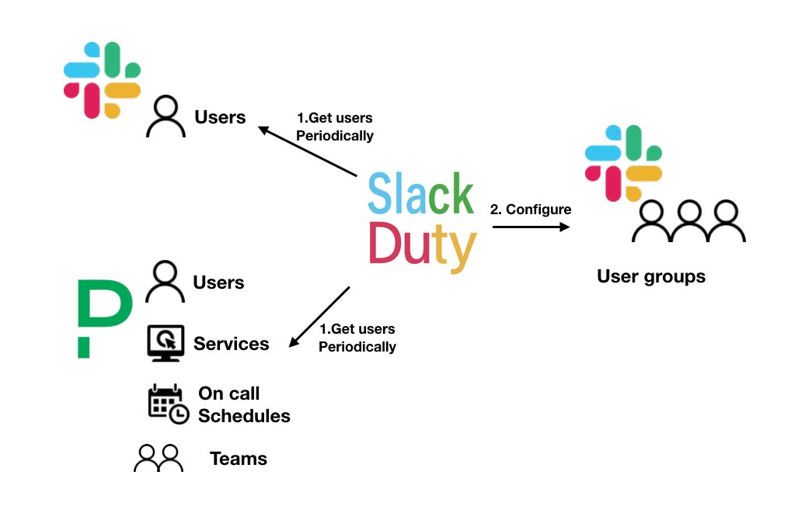

# Slackduty

> Slackduty synchronize Slack usergroup based on PagerDuty users, teams, services and schedules


[](https://github.com/ellerbrock/open-source-badges/)

*NOTE: THis is not for production usage yet. It is under PoC.*

## Design

<br />
  <p align="center"><a href="#" target="_blank" rel="noopener noreferrer"></a></p>
<br />

Slackduty fetches the users based on the PagerDuty resources.  
You can also specify the Slack user and users you don't want to include.

## How to run

You can test in your local environment before deploying.  
First clone this repository to your local environment.

```console
$ git clone https://github.com/KeisukeYamashita/slackduty
```

And then copy the config YAML file to the path where Slackduty looks for and edit the file.

```console
$ mkdir ~/.slackduty
$ cp ./config/example.yml ~/.slackduty/config.yml
```

Make sure that you configure the enviroment varibles.

```console
$ cp .envrc.sample .envrc

# fill in the API keys
$ vim .envrc 
$ direnv allow
```

Edit the file and run slackduty.

```console
$ go run main.go
```

## How to deploy

There are various ways to deploy the Slackduty.

### 1. Single process

<details><summary>Deploy as single process</summary>

You can just run Slackduty as a process by the way you did as running in your environment.

```console
$ go run main.go
```

</details>

### 2. Kuberenetes CronJob

<details><summary>Deploy as Kubernetes CronJob</summary>

Dockerize this application and save to your container registry.  
Here, I used Google Container Registry.

```console
$ docker build . -t gcr.io/my-project/slackduty
$ docker push gcr.io/my-project/slackduty
```

And then create a edit the Cronjob Kubernetes resource.  
Note that to run by Cronjob, you have to configure `SLACKDUTY_EXTERNAL_TRIGGER` to `true` because it will no use the internal cron, it will use
the Kubernetes cron to execute the job.

First, create a secret for API keys.

```console
$ kubectl create secret generic slackduty-api-key --from-literal=slack-api-key=$SLACKDUTY_SLACK_API_KEY --from-literal=pagerduty-api-key=$SLACKDUTY_PAGERDUTY_API_KEY
```

Second, create a Config Map for the config file.

```console
$ kubectl create configmap slackduty-configmap --from-file $SLACKDUTY_CONFIG
```

Then deploy the Cronjob. Schedule is the entire schedule trigger.

```yaml
apiVersion: batch/v1beta1
kind: CronJob
metadata:
  name: slackduty
  labels:
    cronjob: slackduty
spec:
  concurrencyPolicy: Replace
  schedule: "* * * * 1-5"
  jobTemplate:
    spec:
      template:
        spec:
          containers:
          - name: slackduty
            image: gcr.io/my-project/slackduty
            imagePullPolicy: IfNotPresent
            env:
              - name: SLACKDUTY_EXTERNAL_TRIGGER
                value: "true"
              - name: SLACKDUTY_CONFIG
                value: /root/.slackduty/config.yml
              - name: SLACKDUTY_PAGERDUTY_API_KEY
                valueFrom:
                  secretKeyRef:
                    name: slackduty-api-key
                    key: pagerduty-api-key
              - name: SLACKDUTY_SLACK_API_KEY
                valueFrom:
                  secretKeyRef:
                    name: slackduty-api-key
                    key: slack-api-key
            args:
              - "/bin/slackduty"
            volumeMounts:
              - name: slackduty-config
                mountPath: /root/.slackduty/config.yml
                subPath: config.yml
          restartPolicy: OnFailure
          volumes:
            - name: slackduty-config
              configMap:
                name: slackduty-config
```

</details>

## How to configure

Slackduty will read the `SLACKDUTY_CONFIG` path for `config.yml`. If not configured, it will read the default path `~/.slackduty/config.yml`.

This is one example of Slackduty configuration.

```yaml
groups:
  - name: "Example usergroup"
    schedule: "0 0 12 * *" 
    usergroups:
     - "handle:slackduty-oncall"
    members: 
      slack: 
        - "email:manager@slackduty.com"
      pagerduty:
        users:
          - "name:keke@slackduty.com"
        services:
          - "name:slackduty-frontend"
        teams:
          - "name:slackduty-web"
          - "name:slackduty-node"
        schedules:
          - "name:web-oncall"
      exclude:
        - "name:boss@slackduty.com"
```

Here are the details of the `group` object.

| field | description | examples | required |
|:----:|:----|:----|:----:|
| `name`  | The name of the group.  |  `Keke on-call group` | ❌ |  
| `schedule`  | Schedule of the sync between Slack usergroup and Pagerduty resources  | `0 0 * * *` | ✅(if `SLACKDUTY_EXTERNAL_TRIGGER` is not configured) |
| `usergroups` | Usergroup(s) that members belongs | `handle:slackduty-oncall-members` | ✅ |
| `members` |  Members that belongs to the `usersgroups`. Slack user and PagerDuty resources can be specified. | - | ✅ |

### Configure Slack usergroups

You can specify multiple usergroups these prefixes.

Suppored types:

- `id`: ID of the Slack usergroup
- `handle`: Handle name of the Slack usergroup

<details><summary>Example config</summary>

```yaml
groups:
  - name: "Example usergroup"
    ...
    usergroups:
     - "id:9e74vo9j8"
     - "handle:slackduty-oncall"
```

</details>

### Configure members of the usergroup

You can select members of Slack user or PagerDuty resources users.  
Duplication of users will be ignored so you don't have to care about it.

#### 1. Slack user

You can add Slack user to a Slack usergroup by ID or email.

Suppored types: 

- `id`: Slack user ID
- `email`: Slack user email

<details><summary>Example config</summary>

```yaml
groups:
  - name: "Example usergroup"
    ...
    members: 
      slack: 
        - "id:At3t877enoce"
        - "email:manager@slackduty.com"
    ...
```

</details>

#### 2. PagerDuty resources members

##### 2.1 Users

You can add PagerDuty users to Slack usergroups by PagerDuty user ID or email.

Suppored types: 

- `id`: PagerDuty ID
- `name`: Same as `email`
- `email`: User email on PagerDuty

<details><summary>Example config</summary>

```yaml
groups:
  - name: "Example usergroup"
    ...
    members: 
      pagerduty:
        users: 
          - "id:PHO2330E"
          - "name:vp@slackduty.com"
          - "email:manager@slackduty.com"
    ...
```

</details>

##### 2.2 Teams

Add a PagerDuty team members by specifing the team ID or the name.

Supported types:

- `id`: PagerDuty Team ID
- `name`: Name of the team

<details><summary>Example config</summary>

```yaml
groups:
  - name: "Example usergroup"
    ...
    members: 
      pagerduty:
        teams: 
          - "id:TM450330Z"
          - "name:slackduty-web"
    ...
```

</details>

##### 2.3 Services

Add teams users that is in charge of the service(s) by specifying the service ID of the service name.

Supported types:

- `id`: PagerDuty Service ID
- `name`: Name of the service

<details><summary>Example config</summary>

```yaml
groups:
  - name: "Example usergroup"
    ...
    members: 
      pagerduty:
        services: 
          - "id:SV9928290F"
          - "name:slackduty-frontend"
    ...
```

</details>

##### 2.4 Schedulers(On-call members)

You can add on-call members at the execution time to usergroup by specifying the schedule ID or schedule name.

Supported types:

- `id`: PagerDuty Schedule ID
- `name`: Name of the schedule

<details><summary>Example config</summary>

```yaml
groups:
  - name: "Example usergroup"
    ...
    members: 
      pagerduty:
        schedules: 
          - "id:SH1103290H"
          - "name:slackduty-frontend-oncall"
          - "name:slackduty-web-oncall"
    ...
```

</details>

#### Exclude members

You can specify the Slack ID or the email you want to exclude from the Slack usergroup(s).

<details><summary>Example config</summary>

```yaml
groups:
  - name: "Example usergroup"
    ...
    exclude:
      - "id:CH2984NE"
      - "email:slackduty@example.com"
```

</details>

## Contribution

I welcome any contribution!  
If you'd like to contribute to Slackduty, please see [Development Setup Guide](./docs/development-setup.md) and sent a Github Issue or a Pull request.

## Author

[KeisukeYamashita](https://github.com/KeisukeYamashita)


## License

Copyright 2020 Keisuke Yamashita.  
Licensed under the Apache 2.0 License.
